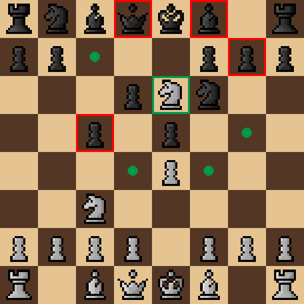

# Chess
Full feature Chess (En Passant, Check/Draw Detection, Castling, Legal Moves Only, Threefold Repetition and Fifty Moves Rule) with AI opponent.



## Install
```
pip install pygame pytest
```

## Play
**GUI** (requires pygame):
```
python play.py
```

**Terminal** (no dependencies):
```
python play_cli.py
```

## Controls
- **Left click** — select piece / move
- **Right click** — deselect
- **← arrow** — undo move
- **Q** — return to menu

## Run Tests
```
python -m pytest tests/ -v
```
